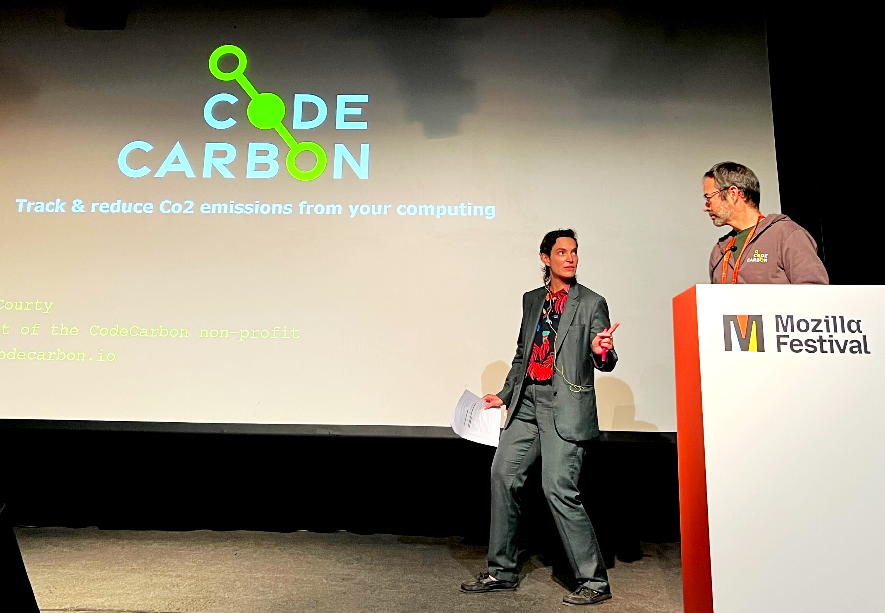
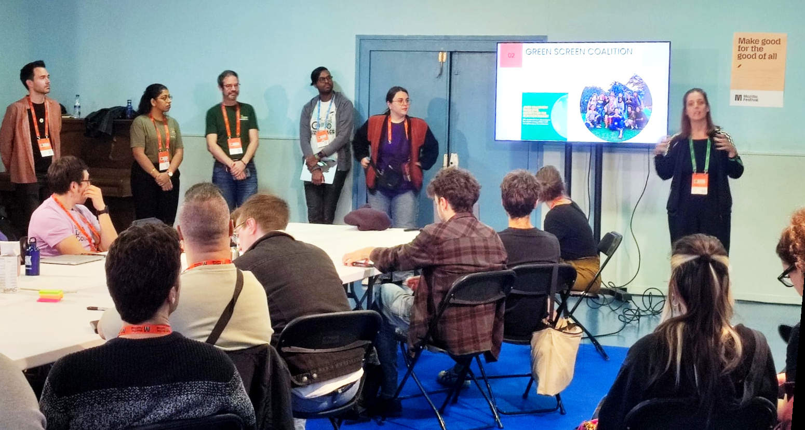

CodeCarbon is proud to be part of the Mozilla Foundation Incubator.

# Mozilla Foundation

The Mozilla Foundation is dedicated to make a better technology future. It's the parent of the Mozilla Corporation, well known for [Firefox browser](https://www.firefox.com/en-US/). The foundation also supports a large number of initiatives.

They have just launched the Mozilla Foundation Incubator and we are proud to have been selected in the first cohort.

# The Grant

We are really happy to get some money, moreover we will receive coaching from amazing people.

This will allow us to make CodeCarbon a better tool, grow our community and figure out how to became a financially sustainable non-profit.

# MozFest

Four contributors of CodeCarbon came to MozFest in Barcelona, from France, to:

- Meet the Mozilla Foundation program managers,
- Meet the other grantees : [Fundación Via Libre](https://www.vialibre.org.ar/), [EyeClimate](https://eyeclimate.com/) and [Air Quality](https://proyectorespira.net/)
- Participate in a forum of the [Green Screen Coalition](https://greenscreen.network/en/)
- Present our project on stage to [Abeba Birhane](https://en.wikipedia.org/wiki/Abeba_Birhane), [Gemma Galdón-Clavell](https://en.wikipedia.org/wiki/Gemma_Gald%C3%B3n-Clavell) and [Chad Fowler](https://chadfowler.com/) that will be our advisors, together with [Danielle Bennett](https://www.mozillafoundation.org/fr/what-we-do/grantmaking/incubator/danielle-bennett/), what a chance!
- Blow up our mind by listening to amazing talks from [Abeba Birhane](https://en.wikipedia.org/wiki/Abeba_Birhane), [Audrey Tang](https://en.wikipedia.org/wiki/Audrey_Tang), [Chelsea Manning](https://en.wikipedia.org/wiki/Chelsea_Manning) and [many more](https://schedule.mozillafestival.org/schedule)

This was a great moment!
